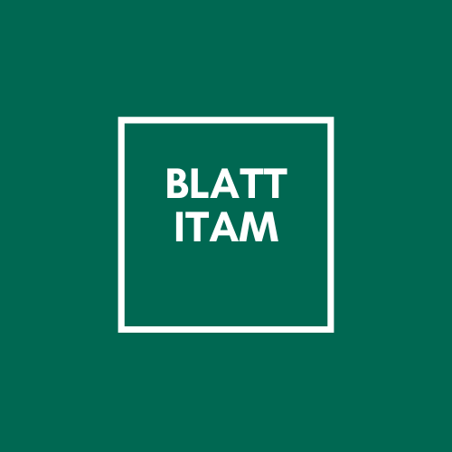

# 
Equipo: Los Softwerinos    
Integrantes:
- Andrea de Anda Kuri
- Miguel Ángel Cifuentes Jiménez
- Damian Pérez Landeros
- Isaías Jesús García Moreno

## 1. Software Requirements
Ir al documento del [SRS](./Especificacion_De_Requerimientos_del_Sistema.md)

## 2. Plan de Calidad
Ir al documento del [Plan de Calidad](./TestPlan.md)

## 3. Arquitectura
Para desarrollar "BLATT ITAM" se ha optado por una arquitectura de **microservicios.**

## 4. Metodología

## 5. Documento para replicar

## 6. Presentación
