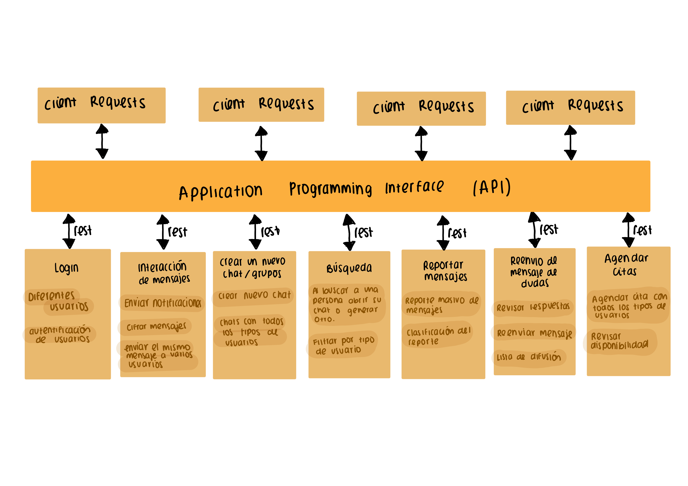

 

  

Equipo: **Los Softwerinos**   

Integrantes:     
- Andrea de Anda Kuri           
- Miguel Ángel Cifuentes Jiménez            
- Damian Pérez Landeros             
- Isaías Jesús García Moreno          

## 1. Software Requirements
Ir al documento del [SRS](./Especificacion_De_Requerimientos_del_Sistema.md)

## 2. Plan de Calidad
Ir al documento del [Plan de Calidad](./TestPlan.md)

## 3. Arquitectura
### Microservicios  
A la hora de decidir que tipo de arquitectura usar para el proyecto nuestra primer alternativa fueron los microservicios. Una vez que analizamos las ventajas y desventajas de la misma nos dimos cuenta que en efecto, era la que más nos convenia. Al combinar la arquitectura de microservicios con una metodología agile pudimos trabajar de forma muy eficiente pues los diferentes componentes de nuestra plataforma son principalmente independientes. 

El diagrama de la arquitectura de BLATT es:

  

Optamos por utilizar una arquitectura de microservicios simple y sencillamente por que consideramos que es la mejor para el desarrollo 
de nuestra aplicación. 
Las ventajas de este tipo de arquitectura son su agilidad, facilidad de despliegue, facilidad de probar, escalabilidad y facilidad de desarrollar. 
Por otra parte, la desventaja es que al tener muchos usuarios el desempeño puede ser lento, sin embargo, la plataforma está diseñada para uso exclusivo de la comunidad ITAM entonces no necesitamos que soporte cantidades muy grandes de usuarios. 

## 4. Metodología
Para el desarrollo de la aplicación utilizamos la metodología SCRUM ya que, de esta manera logramos tener resultados funcionales en poco tiempo. 

La manera de implementar esta metodología fue asignando un SCRUM Master, para que constantemente aplicaremos la metodología SCRUM en nuestro proceso de trabajo. Al haber establecido el SCRUM Master, dividimos en una lista de tareas el desarrollo del proyecto, estableciendo  un plazo de entrega a cada tarea. De esta manera tomamos un conjunto de estas tareas para realizarlas en sprints. Cada sprint al principio tuvo un tiempo de planeación y asignación de responsabilidades, para más tarde realizar el trabajo y por último hacer una retroalimentación del trabajo realizado.

La manera en que seleccionamos las tareas para cada sprint, fue agruparlos en funcionalidades que dieran resultado un módulo, siendo estos los servicios de nuestra aplicación.
Es importante recalcar que en este caso no tuvimos un product owner ya que, no tuvimos un acercamiento con el cliente (ITAM). En este caso, como estudiantes del ITAM, asumimos las necesidades del ITAM y con base en ello realizamos las funcionalidades de nuestra aplicación.

Adicionalmente, consideramos que una ventaja de esta metodología es el "pair programming" en conjunto con la comunicación necesaria para lograr terminar con todo. Fue un proceso algo complicado pues, al ser final del semestre, todos teníamos muchas responsabilidades; sin embargo, mantenernos en comunicación constante y trabajar como un equipo que no le tiene miedo al cambio fue algo que nos permitió disfrutar el proceso y terminar en tiempo y forma. 
## 5. Documento para replicar

## 6. Presentación
La presentación que se expuso en clase el 27 de noviembre se puede ver [aquí](./presentacionProyecto.pdf)

 

